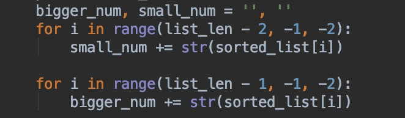

# Task3
## Problem Description 
Rearrange Array Elements so as to form two number such that their sum is maximum. Return these two numbers.
You can assume that all array elements are in the range [0, 9].
The number of digits in both the numbers cannot differ by more than 1.
You're not allowed to use any sorting function that Python provides and the expected time complexity is O(nlog(n)).

## Solution
We can easily find that two maximum sum number in a sorted array list1. Where $number1 = list1[-1]+list1[-3]+....$
$number2 = list1[-2]+list1[-4]+....$
Considering the time complexity is O(nlog(n)), sort algorithm like merge sort should be considered. 
Thus we sort the the list with merge sort algorithm, Costing time  O(nlog(n)), then with use the index (pointer) to construct two number Costing O(1)

Time complexity for is $O(nlog(n))$ 
Space complexity is O(1) ,cost by the merge list.