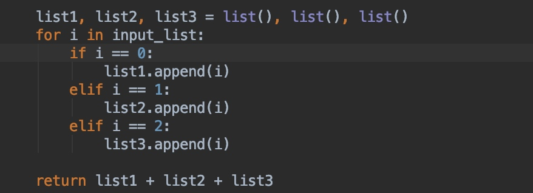

# Task4 
## Problem Description 
Given a list contains only 0,1,2,  sort the array in a single traversal.
Eg, input list may look like this:
[0, 0, 2, 2, 2, 1, 1, 1, 2, 0, 2]

## Solution
We can only traverse the list once and return a sorted list. Since there is only three value element in the list(0,1,2). We can create 3 sub_list separately, we traveling from first to the end of the list, append each element to the sublist accordingly. 

Time complexity for sort the array in a single traversal is $O(N)$, N is the length of the input list
Space complexity is O(N), N is the length of the input list 